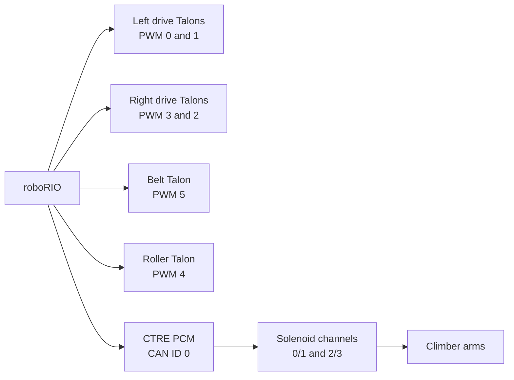
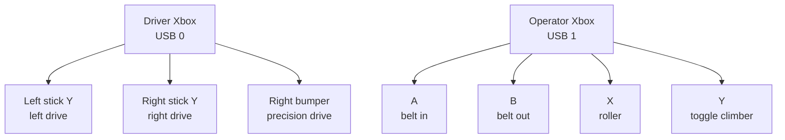
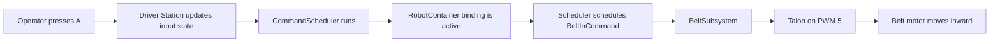
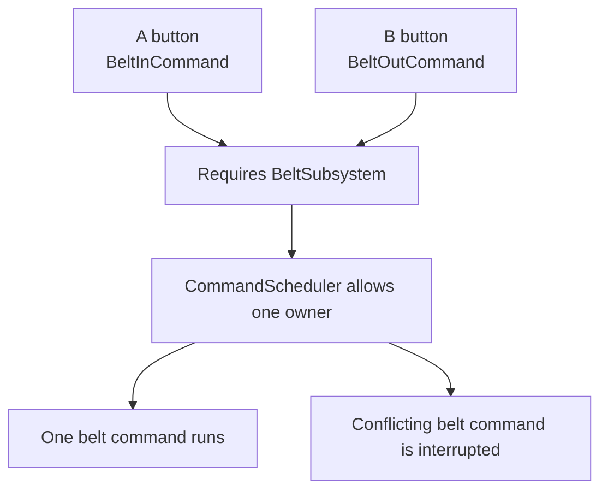
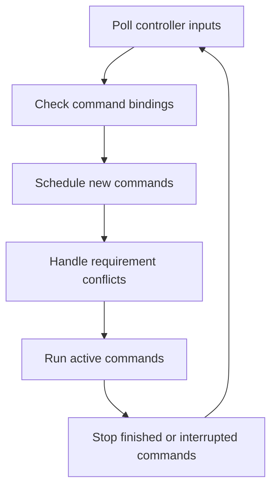
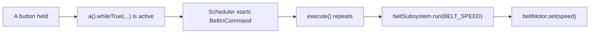
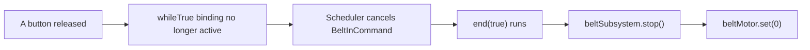

# FRC Command-Based Robot Controls

Draft presentation source

Date: 2026-10-05

Status: discussion draft, not yet converted to PPTX

Audience: beginner FRC students learning how this robot's controls connect to command-based Java code.

---

## Slide 1: FRC Command-Based Robot Controls

How an Xbox button becomes robot motion

Course path:

1. Physical robot parts

2. Command-based rules

3. Java source files

Speaker notes:

This presentation uses the current 2026 robot source as the authority. The repeated example is Operator A, which runs the belt inward.

---

## Slide 2: The Robot's Jobs
| Robot job         | Mechanism                 | Student-friendly description               |
| ----------------- | ------------------------- | ------------------------------------------ |
| Drive             | Left and right drivetrain | Moves and turns the robot with tank drive  |
| Move game pieces  | Belt                      | Moves balls inward or outward              |
| Score game pieces | Roller                    | Runs the outtake roller                    |
| Climb             | Pneumatic climber arms    | Extends or retracts arms with air pressure |
Speaker notes:

Start with what students can see on the robot. The code exists to control these mechanisms.

---

## Slide 3: Hardware Map
| Mechanism          | Source object                                      | Hardware ID                       | Physical function             |
| ------------------ | -------------------------------------------------- | --------------------------------- | ----------------------------- |
| Left drive motors  | `Talon frontLeftMotor`, follower `backLeftMotor`   | PWM `0`, PWM `1`                  | Drives left side              |
| Right drive motors | `Talon frontRightMotor`, follower `backRightMotor` | PWM `3`, PWM `2`                  | Drives right side             |
| Belt               | `Talon beltMotor`                                  | PWM `5`                           | Moves balls inward or outward |
| Roller             | `Talon rollerMotor`                                | PWM `4`                           | Runs outtake roller           |
| Climber arms       | Two `DoubleSolenoid` objects                       | CTRE PCM CAN ID `0`, solenoid channels `0/1` and `2/3` | Moves climber arms            |
Speaker notes:

The current repo uses WPILib `Talon` motor controllers on PWM ports.
Newer robots may use motor controllers on the CAN bus, but those devices still use numeric IDs in code.

---

## Slide 4: Hardware Map Diagram



Speaker notes:

Each hardware ID connects to one physical control point on the robot.
The PCM itself is a CAN device with CAN ID 0. The solenoids plug into numbered PCM output channels.

---

## Slide 5: Two Xbox Controllers
| USB port | Controller               | Main responsibility            |
| -------- | ------------------------ | ------------------------------ |
| `0`      | Driver Xbox controller   | Tank drive and precision drive |
| `1`      | Operator Xbox controller | Belt, roller, and climber      |
Before enabling:

- Check the Driver Station USB tab
- Driver controller must appear before operator controller

---

## Slide 6: Controller Map
| Port | Controller    | Input         | Code path                      | Robot action           |
| ---- | ------------- | ------------- | ------------------------------ | ---------------------- |
| `0`  | Driver Xbox   | Left stick Y  | `getLeftY()`                   | Left drivetrain speed  |
| `0`  | Driver Xbox   | Right stick Y | `getRightY()`                  | Right drivetrain speed |
| `0`  | Driver Xbox   | Right bumper  | `rightBumper().whileTrue(...)` | Precision drive        |
| `1`  | Operator Xbox | A             | `a().whileTrue(...)`           | Belt inward            |
| `1`  | Operator Xbox | B             | `b().whileTrue(...)`           | Belt outward           |
| `1`  | Operator Xbox | X             | `x().whileTrue(...)`           | Roller                 |
| `1`  | Operator Xbox | Y             | `y().onTrue(...)`              | Toggle climber arms    |
---

## Slide 7: Controller Layout Diagram



---

## Slide 8: Golden Trace Preview

Operator A is the example we will follow.



Speaker notes:

The rest of the deck explains each box in this trace.
---

## Slide 9: Subsystems and Commands
| Concept     | What it represents                                               | Example from this robot                      |
| ----------- | ---------------------------------------------------------------- | -------------------------------------------- |
| Subsystem   | A physical part of the robot and the code that owns its hardware | `BeltSubsystem` owns `beltMotor`             |
| Command     | An action that tells a subsystem what to do                      | `BeltInCommand` tells the belt to run inward |
| Requirement | A lock on a subsystem while a command uses it                    | `BeltInCommand` requires `BeltSubsystem`     |
Key idea:

Commands decide when to act. Subsystems know how to act.

---

## Slide 10: Why Requirements Exist



Speaker notes:

Button A and Button B ask the same motor to do opposite things. Requirements keep that conflict controlled.
If a conflicting belt command is already running, the scheduler interrupts it, ends it, and then gives the new command control.

---

## Slide 11: Command Types
| Control pattern  | Code pattern                 | Robot example | Behavior                            |
| ---------------- | ---------------------------- | ------------- | ----------------------------------- |
| Hold to run      | `whileTrue(command)`         | A, B, X       | Runs while button is held           |
| Tap once         | `onTrue(command)`            | Y             | Runs once when button is pressed    |
| Always available | `setDefaultCommand(command)` | Drive command | Runs when subsystem is idle         |
| State modifier   | `whileTrue(command)`         | Right bumper  | Changes drive speed mode while held |
---

## Slide 12: Command Lifecycle
| Method             | When it runs                      | Example use                                         |
| ------------------ | --------------------------------- | --------------------------------------------------- |
| `initialize()`     | When command starts               | Toggle climber arms once                            |
| `execute()`        | Repeated while command runs       | Keep belt motor running                             |
| `end(interrupted)` | When command stops                | Stop belt motor                                     |
| `isFinished()`     | Scheduler asks if command is done | Belt returns `false`; climber toggle returns `true` |
---

## Slide 13: The 20 ms Scheduler Loop



About 50 times per second, `robotPeriodic()` calls:

```java

CommandScheduler.getInstance().run();

```

---

## Slide 14: What Happens When A Is Held



Speaker notes:

The belt command does not finish on its own. It keeps returning `false` from `isFinished()`, so release of the button cancels it.

---

## Slide 15: What Happens When A Is Released



---

## Slide 16: What Happens If A and B Are Pressed
| Step | What the scheduler sees                   | Result                                    |
| ---- | ----------------------------------------- | ----------------------------------------- |
| 1    | A asks for `BeltInCommand`                | `BeltSubsystem` gets claimed              |
| 2    | B asks for `BeltOutCommand`               | Scheduler sees the same requirement       |
| 3    | Both commands require `BeltSubsystem`     | Only one belt command can own it          |
| 4    | Scheduler interrupts the previous command | Previous `end(...)` stops the belt output |
| 5    | New command runs                          | Belt follows the active command           |
Speaker notes:

Avoid pressing both belt buttons at once. The command framework still prevents two commands from owning the same subsystem at the same time.

---

## Slide 17: Source File Map
| File                    | Role in the robot                                                      |
| ----------------------- | ---------------------------------------------------------------------- |
| `Constants.java`        | Stores hardware IDs, controller ports, and tuning values               |
| `RobotContainer.java`   | Creates controllers, subsystems, default commands, and button bindings |
| `DriveSubsystem.java`   | Owns drive Talons                                                      |
| `BeltSubsystem.java`    | Owns belt Talon                                                        |
| `RollerSubsystem.java`  | Owns roller Talon                                                      |
| `ClimberSubsystem.java` | Owns climber solenoids                                                 |
| `commands/*.java`       | Defines robot actions                                                  |
---

## Slide 18: `Constants.java`
| Constant group | Examples                                           | What students should change here |
| -------------- | -------------------------------------------------- | -------------------------------- |
| `Hardware`     | `PWM_BELT = 5`, `PWM_ROLLER = 4`                   | Hardware ports and channels      |
| `Operator`     | `DRIVER_CONTROLLER = 0`, `OPERATOR_CONTROLLER = 1` | Driver Station USB ports         |
| `Tuning`       | `BELT_SPEED = 1.0`, `SLOW_DRIVE_SCALE = 0.20`      | Speeds, scaling, deadband        |
Speaker notes:

`Constants.java` is the safe first place to look for numeric robot settings.

---

## Slide 19: `BeltSubsystem.java`

Visible code:

```java
private final Talon beltMotor;
```

```java
public void run(double speed) {
    beltMotor.set(speed);
}
```

```java
public void stop() {
    run(0);
}
```

Takeaway:

`BeltSubsystem.run(...)` is our helper method. Inside it, our code calls WPILib's `Talon.set(...)`, which sends the motor output to PWM port `5`.
---

## Slide 20: `BeltInCommand.java`

Visible code:

```java

public BeltInCommand(BeltSubsystem beltSubsystem) {

    this.beltSubsystem = beltSubsystem;

    addRequirements(beltSubsystem);

}

```

```java

public void execute() {

    beltSubsystem.run(Constants.Tuning.BELT_SPEED);

}

```

```java

public void end(boolean interrupted) {

    beltSubsystem.stop();

}

```

Takeaway:

The command claims the belt, runs it, and stops it when the command ends.

---

## Slide 21: `RobotContainer.java`

Controller creation:

```java

driverController = new CommandXboxController(Constants.Operator.DRIVER_CONTROLLER);

operatorController = new CommandXboxController(Constants.Operator.OPERATOR_CONTROLLER);

```

Button binding:

```java

operatorController.a()

    .whileTrue(new BeltInCommand(beltSubsystem));

```

Takeaway:

`RobotContainer` is the wiring hub that connects controller inputs to commands.

---

## Slide 22: Full Operator A Code Trace

```mermaid
flowchart LR
    A["RobotContainer.configureBindings()"] --> B["A button is bound to BeltInCommand"]
    B --> C["CommandScheduler.run() repeats"]
    C --> D["Scheduler sees A held"]
    D --> E["Scheduler calls BeltInCommand"]
    E --> F["Our method: BeltSubsystem.run(...)"]
    F --> G["WPILib call: Talon.set(...)"]
    G --> H["roboRIO PWM 5"]
    H --> I["Belt motor"]
```



Takeaway:

`RobotContainer` sets up the binding once. After that, the scheduler calls the command when the control is used.
---

## Slide 23: Operator A Lookup Trace
| Stage               | File                  | Code item                               | Meaning                                                                        |
| ------------------- | --------------------- | --------------------------------------- | ------------------------------------------------------------------------------ |
| Binding             | `RobotContainer.java` | `operatorController.a().whileTrue(...)` | A button schedules command while held                                          |
| Command requirement | `BeltInCommand.java`  | `addRequirements(beltSubsystem)`        | Tells the scheduler this command needs exclusive control of the belt subsystem |
| Motor request       | `BeltInCommand.java`  | `beltSubsystem.run(...)`                | Command calls our belt helper method                                           |
| WPILib motor call   | `BeltSubsystem.java`  | `beltMotor.set(speed)`                  | Calls WPILib's `Talon` API to set the PWM motor output                         |
| Physical result     | Robot wiring          | PWM `5`                                 | roboRIO sends the output to the belt motor                                     |
---

## Slide 24: Other Control Traces
| Input                | Binding               | Command or read path       | Result                |
| -------------------- | --------------------- | -------------------------- | --------------------- |
| Driver left stick Y  | Default drive command | `getLeftDriveValue()`      | Left drive output     |
| Driver right stick Y | Default drive command | `getRightDriveValue()`     | Right drive output    |
| Driver right bumper  | `whileTrue`           | `SlowDriveCommand`         | Precision drive scale |
| Operator B           | `whileTrue`           | `BeltOutCommand`           | Belt runs outward     |
| Operator X           | `whileTrue`           | `RollerCommand`            | Roller runs           |
| Operator Y           | `onTrue`              | `ToggleClimberArmsCommand` | Climber arms toggle   |
---

## Slide 25: Student Practice
| Exercise | Prompt                                                 |
| -------- | ------------------------------------------------------ |
| 1        | Trace Operator A from button press to belt motion      |
| 2        | Explain why A and B cannot both own `BeltSubsystem`    |
| 3        | Explain why A uses `whileTrue()` and Y uses `onTrue()` |
| 4        | Find where belt speed is stored                        |
| 5        | Find where the operator controller USB port is stored  |
---

## Slide 26: Extension Discussion

Questions for students:
| Question                                           | Where to look first                               |
| -------------------------------------------------- | ------------------------------------------------- |
| How would you make belt speed slower?              | `Constants.Tuning.BELT_SPEED`                     |
| How would you change the operator controller port? | `Constants.Operator.OPERATOR_CONTROLLER`          |
| How would you add a new button command?            | `RobotContainer.configureBindings()`              |
| How would you make a new mechanism safe?           | Create a subsystem, then require it from commands |
Speaker notes:

This slide turns the presentation into a code-reading activity.
