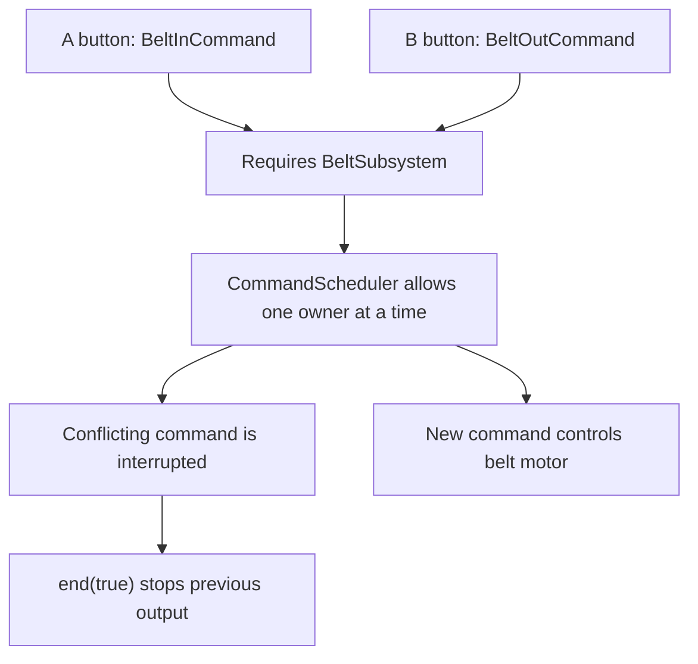
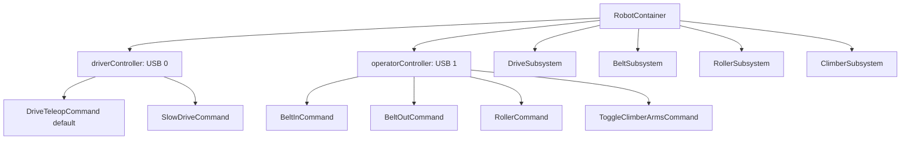

# Beginner-Friendly FRC Command-Based Robotics Guide

Version: v4 discussion draft
Date: 2026-10-05
Source basis: `C:\Users\dmona\Downloads\pure-command-based-curriculum-guide-v3.md`
Repo authority: current Java source plus `CONTROLS.md`

This file is a planning document for a future slide deck. It is not the deck yet.

## Goal

Teach beginning FRC students how this robot's command-based code maps from physical controls to robot motion.

The deck should preserve the useful table-first style of v3 while adding diagrams that show the same information as a story. Tables are for lookup. Diagrams are for flow.

There is no hard 15-slide limit. Use the number of slides needed to keep each slide teachable, readable, and useful as a student reference.

## Source-Accuracy Corrections From v3

The v3 guide is directionally strong, but a few details need to be corrected before it becomes slide material.

| Topic | v3 wording | Current source-correct wording |
| --- | --- | --- |
| Drive motor controllers | Spark MAX | WPILib `Talon` PWM motor controllers |
| Belt motor controller | Talon SRX | WPILib `Talon` on PWM port `5` |
| Roller motor controller | Talon SRX | WPILib `Talon` on PWM port `4` |
| Belt subsystem field | `m_beltMotor` | `beltMotor` |
| Belt command field | `m_beltSubsystem` | `beltSubsystem` |
| Motor update path | Subsystem `periodic()` sends final values | Commands call subsystem methods; subsystem methods call `Talon.set(...)` directly |
| Driver Station story | roboRIO immediately generates PWM after packet | Driver Station updates input state; scheduler sees binding; command calls subsystem; subsystem sets motor output |
| Slow drive | General state modifier | `SlowDriveCommand` sets `DriveSpeedMode`; `DriveTeleopCommand` reads that state |

## Current Robot Control Map

Use this table as the slide-deck source of truth.

| Driver Station port | Controller role | Input | Binding or read path | Robot action |
| --- | --- | --- | --- | --- |
| `0` | Driver Xbox controller | Left stick Y | `driverController.getLeftY()` | Left drivetrain speed |
| `0` | Driver Xbox controller | Right stick Y | `driverController.getRightY()` | Right drivetrain speed |
| `0` | Driver Xbox controller | Right bumper | `driverController.rightBumper().whileTrue(...)` | Precision drive while held |
| `1` | Operator Xbox controller | A button | `operatorController.a().whileTrue(...)` | Run belt inward while held |
| `1` | Operator Xbox controller | B button | `operatorController.b().whileTrue(...)` | Run belt outward while held |
| `1` | Operator Xbox controller | X button | `operatorController.x().whileTrue(...)` | Run scoring roller while held |
| `1` | Operator Xbox controller | Y button | `operatorController.y().onTrue(...)` | Toggle climber arms once |

## Current Hardware Map

| Mechanism | Source object | Hardware ID | Physical function |
| --- | --- | --- | --- |
| Left drive motors | `Talon frontLeftMotor`, follower `backLeftMotor` | PWM `0`, PWM `1` | Drives left side of tank drive |
| Right drive motors | `Talon frontRightMotor`, follower `backRightMotor` | PWM `3`, PWM `2` | Drives right side of tank drive |
| Ball conveyance belt | `Talon beltMotor` | PWM `5` | Moves game pieces inward or outward |
| Scoring roller | `Talon rollerMotor` | PWM `4` | Runs the outtake roller |
| Climber arms | Two `DoubleSolenoid` objects | CTRE PCM CAN ID `0`, solenoid channels `0/1` and `2/3` | Extends or retracts climber arms |

Note: The right-drive constants are `PWM_BACK_RIGHT_DRIVE = 2` and `PWM_FRONT_RIGHT_DRIVE = 3`. `DriveSubsystem` creates the front motor first, then adds the back motor as a follower.

## Recommended Teaching Pattern

Use pairs of slides:

1. A table slide that names all parts.
2. A diagram slide that follows one example through those parts.

For example:

1. Controller table.
2. Operator A signal-flow diagram.
3. Command type table.
4. Scheduler conflict diagram.

This keeps tables without making every slide feel like a spreadsheet.

## Version A: Compact 15-Slide Revision

This version stays close to v3. It is useful if presentation time is short.

| Slide | Title | Main format | Purpose |
| --- | --- | --- | --- |
| 1 | Course Intro | Bullets | Explain the 3-pass learning path |
| 2 | Hardware Map | Table | Name each physical mechanism and hardware ID |
| 3 | Dual Xbox Controller Map | Table | Show every active controller input |
| 4 | Operator A Physical Story | Diagram | Trace A button to belt motion at a high level |
| 5 | Subsystems vs Commands | Two-column table | Define the core command-based split |
| 6 | Requirements and Resource Locking | Diagram | Show why A and B cannot own the belt together |
| 7 | Command Types | Table | Compare `whileTrue`, `onTrue`, default command, state modifier |
| 8 | 20 ms Scheduler Loop | Flow diagram | Show repeated scheduler work |
| 9 | Operator A Scheduler Story | Diagram | Trace scheduler handling of A while held |
| 10 | `Constants.java` | Table | Show hardware IDs and tuning values |
| 11 | Subsystem Files | Table | Map mechanisms to subsystem classes |
| 12 | Command Files | Table | Map controller actions to command classes |
| 13 | `RobotContainer.java` Wiring | Code plus table | Show controller construction and bindings |
| 14 | Operator A Java Story | Code chain | Trace exact code path for belt-in |
| 15 | Student Exercises | Table | Give tracing, conflict, and lifecycle questions |

Strength: fast and clear.

Risk: some slides will be dense, especially slides 2, 3, 7, 10, 11, and 12.

## Version B: Recommended Expanded Table Plus Diagram Plan

This version gives the ideas more room. It keeps tables, but separates lookup from story. The exact slide count can grow or shrink based on how much code is shown live, but the pacing target is one concept per slide.

| Slide | Title | Main format | Purpose |
| --- | --- | --- | --- |
| 1 | What We Are Learning | Bullets | Promise: controller input to robot motion |
| 2 | The Robot's Jobs | Photo/diagram placeholder plus bullets | Drive, belt, roller, climber |
| 3 | Hardware Map | Table | Mechanism, source object, ID, physical job |
| 4 | Hardware Map Diagram | Diagram | Put IDs near mechanisms visually |
| 5 | Two Xbox Controllers | Table | Driver and operator responsibilities |
| 6 | Controller Layout Diagram | Diagram | Show USB `0`, USB `1`, and button jobs |
| 7 | Golden Trace Preview | Diagram | Operator A to belt movement |
| 8 | Subsystems vs Commands | Table | Define physical owner vs action |
| 9 | Why Requirements Exist | Diagram | A and B fighting over `BeltSubsystem` |
| 10 | Command Types | Table | `whileTrue`, `onTrue`, default command, state modifier |
| 11 | Command Lifecycle | Timeline | `initialize`, `execute`, `end`, `isFinished` |
| 12 | The 20 ms Scheduler Loop | Flow diagram | Scheduler repeats about 50 times per second |
| 13 | What Happens When A Is Held | Diagram | Scheduler schedules `BeltInCommand` |
| 14 | What Happens When A Is Released | Diagram | `end(...)` stops the belt |
| 15 | What Happens If A and B Are Pressed | Diagram | Resource conflict and interruption |
| 16 | Source File Map | Table | `Constants`, subsystems, commands, `RobotContainer` |
| 17 | `Constants.java` | Table | Ports and tuning values |
| 18 | `BeltSubsystem.java` | Code plus table | `beltMotor`, `run`, `stop` |
| 19 | `BeltInCommand.java` | Code plus lifecycle | `addRequirements`, `execute`, `end` |
| 20 | `RobotContainer.java` | Code plus callouts | Controller creation and `a().whileTrue(...)` |
| 21 | Full Operator A Code Trace | Diagram | Binding to command to subsystem to motor |
| 22 | Full Operator A Code Trace | Table | Same trace as lookup table with file, method, and line target |
| 23 | Other Controls Quick Traces | Table | B, X, Y, and right bumper mapped through command classes |
| 24 | Student Practice | Table | Trace A, conflict A/B, explain Y vs A |
| 25 | Extension Discussion | Prompts | What would students change or add next? |

Strength: better pacing, easier to present, easier to turn into a deck with diagrams.

Risk: takes longer. Use speaker notes to keep slides from becoming repetitive.

## Version C: Workshop-Length Expansion

If this becomes a full teaching session rather than a short presentation, split the material into modules. This avoids cramming all code into one deck sequence.

| Module | Slides | Focus | Student activity |
| --- | --- | --- | --- |
| 1 | 1-6 | Robot mechanisms and Xbox controls | Students identify which controller input moves each mechanism |
| 2 | 7-12 | Subsystems, commands, requirements, and scheduler | Students explain why A and B cannot safely control the belt together |
| 3 | 13-20 | Source-file walkthrough | Students find each class in the repo and annotate its job |
| 4 | 21-26 | Operator A golden trace | Students trace A through `RobotContainer`, command, subsystem, and motor |
| 5 | 27-30 | Practice and extension | Students propose one safe new control and identify files to edit |

This is the best version for a club lesson or classroom block because it makes room for questions, code reading, and short student checks.

## Diagram Drafts For Version B

These are not final deck artwork. They are content drafts.

### Operator A Golden Trace

```mermaid
flowchart LR
    A["Operator presses A"] --> B["Driver Station updates Xbox state"]
    B --> C["CommandScheduler polls bindings"]
    C --> D["operatorController.a().whileTrue(...)"]
    D --> E["BeltInCommand scheduled"]
    E --> F["BeltInCommand.execute()"]
    F --> G["BeltSubsystem.run(Constants.Tuning.BELT_SPEED)"]
    G --> H["beltMotor.set(speed)"]
    H --> I["Talon on PWM 5 drives belt motor"]
```



### Resource Conflict



### RobotContainer Wiring



## Corrected Operator A Code Trace

Use repo-accurate names in the deck.

### `RobotContainer.java`

```java
operatorController.a()
    .whileTrue(new BeltInCommand(beltSubsystem));
```

### `BeltInCommand.java`

```java
public BeltInCommand(BeltSubsystem beltSubsystem) {
    this.beltSubsystem = beltSubsystem;
    addRequirements(beltSubsystem);
}
```

```java
@Override
public void execute() {
    beltSubsystem.run(Constants.Tuning.BELT_SPEED);
}
```

```java
@Override
public void end(boolean interrupted) {
    beltSubsystem.stop();
}
```

### `BeltSubsystem.java`

```java
private final Talon beltMotor;
```

```java
public void run(double speed) {
    beltMotor.set(speed);
}
```

```java
public void stop() {
    run(0);
}
```

## Student Exercise Set

| Exercise | Prompt | Expected idea |
| --- | --- | --- |
| EX-01 | Trace Operator A from button press to belt motion. | Binding schedules `BeltInCommand`; command calls `BeltSubsystem.run`; Talon PWM `5` drives belt. |
| EX-02 | What happens if A and B are pressed together? | Both require `BeltSubsystem`; scheduler allows one command to own it; one command is interrupted and its `end(...)` stops output. |
| EX-03 | Why is Y `onTrue()` while A is `whileTrue()`? | Y toggles pneumatics once; A runs a motor only while held. |
| EX-04 | What does right bumper do? | Runs `SlowDriveCommand`, which sets shared slow-drive state read by `DriveTeleopCommand`. |
| EX-05 | Where would you change belt speed? | `Constants.Tuning.BELT_SPEED`. |

## Recommendation

Use Version B for a normal presentation deck. Use Version C if this becomes an interactive teaching session.

Keep the table slides because they are useful student references. Add one diagram after each major table so students can see the same information move through the system. Do not force the material into 15 slides if that makes the tables unreadable or compresses the code trace too much.

The deck should keep returning to one concrete example:

`Operator A -> BeltInCommand -> BeltSubsystem -> Talon PWM 5 -> belt motor`

That repeated trace will make the command-based architecture feel less abstract.
